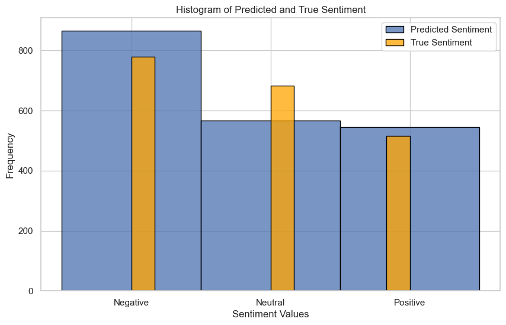

#  Fine-Tuning RoBERTa with Hugging Face Transformers: Unveiling Sentiments in Political News from the 2016 US Presidential Campaign


This repository contains Jupyter notebooks focused. The notebook **RoBERTa_Finetuning_Sentiment.ipynb** is the notebook that 
trains the RoBERTA model (Liu et al. 2019) on the dataset created by Hamborg and Donnay, 2019 (https://huggingface.co/datasets/fhamborg/news_sentiment_newsmtsc).
Please follow the link to Google Colab. The notebooks utilize the Hugging Face Transformers library and datasets from the Hugging Face model hub.
The model can be found here: https://huggingface.co/MaxG1/roberta_fine_tuned_on_newsmstc_02_split


The metrcis are F1 Score: 83.2, Accuracy: 83.4, Precision:83.5, Recall:83.4





## Files Overview

1. **RoBERTa_Finetuning_Sentiment.ipynb:**
see also https://colab.research.google.com/drive/1zOCMZkZlo88Fst9P6CgoHUYaPdqUdqGA?usp=sharing
   - Demonstrates fine-tuning of a RoBERTa model on news sentiment data.
   - Model loading, dataset preparation, tokenization, fine-tuning, and model evaluation.

2. **Classifaction Metrics and Comparison.ipynb:**
   - Compares performance metrics of sentiment analysis models.
   - Data preparation, model loading, sentiment prediction, and comparison of multiple sentiment analysis models.

3. **Multipolarity_and_Bias_Analysis.ipynb:**
   - Analyzes bias and multipolarity in sentiment analysis models.
   - The model has no bias against nationalites.
   - It has a bias towards the ethnicity of US presidents.
   - It is able to evalute charged words like Terrorist (negative), Militant (neutral), or Freedom Fighter (positive) according to current societal discourses.


## How to Use the Pipeline Class

To use the pipeline class for sentiment analysis with the trained RoBERTa model, you can follow these steps in Python:

```python
from transformers import pipeline

# Load the sentiment analysis pipeline
sentiment_pipeline = pipeline('sentiment-analysis', model='MaxG1/roberta_fine_tuned_on_newsmstc_02_split', tokenizer='MaxG1/roberta_fine_tuned_on_newsmstc_02_split')

# Example text for sentiment analysis
text = "Political news during the US Presidential Campaign."

# Get sentiment prediction
result = sentiment_pipeline(text)

# Print the result
print(result)

```


# Bibliography
    - Hamborg, F., & Donnay, K. (2019). NewsMTSC: A Dataset for (Multi-)Target-dependent Sentiment Classification in Political News Articles. In P. Merlo, J. Tiedemann, & R. Tsarfaty (Eds.), Proceedings of the 16th Conference of the European Chapter of the Association for Computational Linguistics: Main Volume (pp. 1663–1675). Association for Computational Linguistics. https://doi.org/10.18653/v1/2021.eacl-main.142
    - Liu, Y., Ott, M., Goyal, N., Du Jingfei, Joshi, M., Chen, D., Levy, O., Lewis, M., Zettlemoyer, L., & Stoyanov, V. (2019, July 26). RoBERTa: A Robustly Optimized BERT Pretraining Approach. http://arxiv.org/pdf/1907.11692.pdf 
    - Moraites, A. (2023, March 24). Fine-tuning RoBERTa for Topic Classification with Hugging Face Transformers and Datasets Library. Medium. https://medium.com/@achillesmoraites/fine-tuning-roberta-for-topic-classification-with-hugging-face-transformers-and-datasets-library-c6f8432d0820